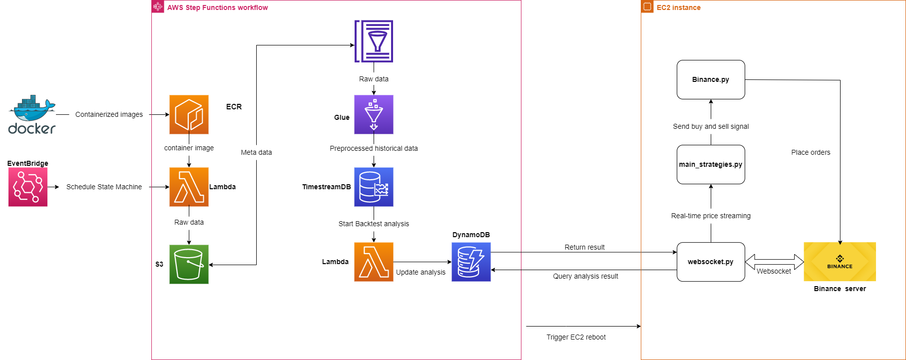

# Crypto-trading-system:
* Terraform as an infrastructure as code tool to deploy AWS resources for the system
* Event-driven architecture with Lambda function, Step function, and  EventBridge
* Automatically update OHLC price data of cryptocurrencies to data lake (S3)
* Transform new data using ETL tool (Glue) and write processed data  to time series database (TimestreamDB)  for later data analysis using Lambda funtion
* A cryptocurrency trading bot running inside EC2 instance and can interact with TimestreamDB and DynamoDB for data-driven decision-making

## Infrastructure of the systems
Phrase 1:
* 1 Lambda function (TopMarketCapUpdate) to scrape list of top market cap coins from binance website  and store it in json format (top_marketcap)
* 1 s3 bucket (TopMarketCapCrypto) to store json file of list topcoin 
* 1 IAM roles (TopMarketCapUpdateRole) to allow all tasks above 

Phrase 2:
* 1 Lambda function (HistoricalDataUpdate) to perform ingestion new historical data
* 1 S3 bucket to store raw historical data in  parquet
* 1 Glue catalog table to store metadata of raw data
* 1 IAM roles (HistoricalDataUpdateRole) to allow all tasks in this phrase

Phrase 3:
* 1 Glue job (GlueETLJob) to extract data from s3, transform and load to Timestream database
* 1 Timestream database (demo-ts-db),1 timestream table (demo-ts-tb) to store processed data 
* 1 IAM role (HistoricalDataETLRole) to allow all tasks in this phrase

Phrase 4:
* 1 Dynamodb table to store new analysis data
* 2 Lambda function to  perform analysis on data from datawarehouse (Timestreamdb) and write results to Dynamodb
* 1 IAM role for all these task in this phrase

Phrase 5:
* 1 EC2 instance where hosts trading bot
* 1 IAM has access to Dynamodb, s3
* 1 trading bot to run within EC2 instance

Phrase 6:
* 1 Eventbridge to schedule State Machine
* 1 State Machine within Step Function

## Future improvement of the system
* Set up  CloudWatch Logs agent in EC2 instance for better monitoring and visualizing trading activities  by automatedly sending logs data to CloudWatch Logs instead of checking result in log file in S3 
* The trading bot can only trade one pair at a time. Integrating  with Apache Kafka to stream real-time price data with high-throughput to the trading system, which allows more trading pairs at the same time with low latency.
* Replace monolithic trading bot with microservices 

## Credentials
* Create your credential: https://www.binance.com/en/support/faq/360002502072
* If you want to test your bot, create your credential on testnet server: https://www.binance.com/en/support/faq/ab78f9a1b8824cf0a106b4229c76496d
* => Input credentials in /modules/TradingBot/tradingbot/credential_info.json

